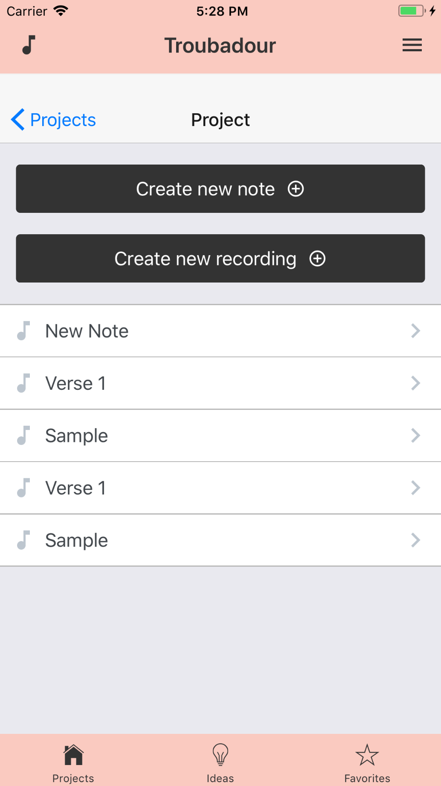
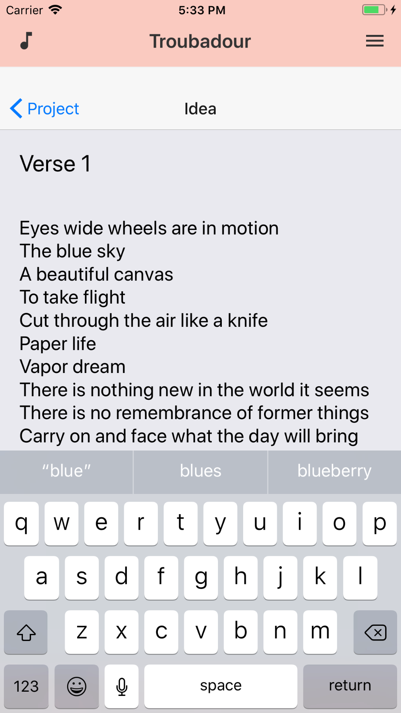
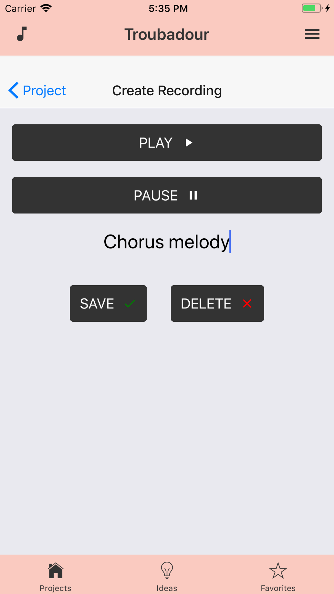

## setup
Run this command: `npm install`

Then open `ios/Troubabdour.xcodeproj` in Xcode.

Running this project in Xcode should automatically start up iOS Simulator.

If you need to link react native libraries (unlikely) run these commands:

```
react-native link react-native-vectors-icons
react-native link react-native-audio
react-native link react-native-sound
react-native link react-native-fs
```

# Troubadour

https://shmmod.github.io/troubadour/

## Summary
Troubadour is an iOS application developed to assist musicians with the song-writing process. Users are able to:
- Create an account and log in using Auth0 (optionally with Google)
- Create new projects, which contain ideas--text notes or recordings
- Playback audio recordings

## Overall Structure
**Back-End**
The app was built using a Node.js + Express backend with a MongoDB database. RESTful API requests return a JSON response. See code [here](https://github.com/SHMMOD/flex-project)

**Front-End**
The front-end was built using React-Native, and it utilizes the Redux architecture. Navigation in between windows is facilitated through the use of the React Native Navigation library. Additionally, authentication is handled via the Auth0 library, permitting users to create an account or sign in using an email/password combination or their Google account.

## Languages
- MongoDB
  - Mongoose
- Node.js
- Express
- React Native
  - Auth0
  - React Native Navigate
  - React Native Audio
  - React Native Sound
  - React Native Elements

## Primary Components
### Authentication
When a user opens Troubadour, they first see the authentication page handled by Auth0. From here, the user can choose to log in using a username/password or a Google account.

<p align="center">
  
</p>

### Projects
A user's notes and recordings--called Ideas--are listed under named projects. In order to populate the projects index, a GET request is made to the back-end. A Mongoose query searches for all projects associated with the user and returns them as an array of project objects.

<p align="center">
  
</p>

### Ideas
Ideas are divided into two categories: notes and recordings. Notes permit users to jot down their thoughts as they write a song. Recordings allow a user to capture melodic inspiration. When a user clicks to create a new note or recording, a POST request is made to the back-end. The body of the POST request determines whether or not to give the title of 'New Note' or 'New Recording'.

```
export const postIdea = async (req, res) => {
  const defaultName = req.body.fileType === 'note' ? 'New Note' : 'New Recording';

  const newIdea = new Idea({
    _id: new mongoose.Types.ObjectId(),
    fileType: req.body.fileType,
    name: defaultName,
    projectId: req.body.projectId,
    userId: req.body.userId
  });

  console.log(`New Idea: ${newIdea}`);

  let savedNewIdea;
  try {
    savedNewIdea = await newIdea.save()
      .catch(err => {
        console.log(err);
        res.status(500).json({ error: true, message: 'Error saving idea' })
      })
      res.status(200).json(savedNewIdea);
    } catch (err) {
      res.status(err.status).json({ error: true, message: 'Error saving idea' });
  }
};
```
<p align="center">
  
  
</p>

The basic front-end structure and navigation through the app was handled using react-native navigation, through a combination of tab and stack navigators. The stack navigator managed all nested navigation throughout the app, including idea indexes nested under a project, and idea show pages nested under an idea index.  Stack navigators take in a navigatorOptions object that must be populated with all the existing screens, including ones that the user potentially creates during use of the app.  To account for this, all project and ideas for a given user (held in the global redux state) are iterated through to populate the navigatorOptions object.  As a result, each project or idea is added to the navigation structure upon its creation.


```
  projects.forEach(project => {
    const projstack = {
      screen: ProjectScreen(project),
      navigationOptions: {
        headerTitle: 'Project'
      }
    };
    navigatorOptions[`Project${project._id}`] = projstack;
  });

  ideas.forEach(idea => {
    const ideastack = {
      screen: IdeaScreen(idea),
      navigationOptions: {
        headerTitle: 'Idea'
      }
    };
      navigatorOptions[`Idea${idea._id}`] = ideastack;
  });

  return StackNavigator(navigatorOptions);

```


## Future Features
- **Rhyming dictionary:** As a user types a note, a GET request will be made to the [RhymeBrain API](http://rhymebrain.com/api.html) to show rhyme suggestions.
- **Search:** A search bar will allow users to search through their project titles; idea titles and content; and creation/update dates. Optionally, the search will occur responsively, meaning that relevant results will populate as the user types.
- **Favorites:** By default, a project and an idea's favorite status is set to false. Users will soon be able to click on a star within the project or the Idea to toggle between marking the item as a favorite. They will be able to see any favorited items in one page.
- **Cloud Storage:**: To ensure the most versatile use of ideas, users will be able to link a popular cloud storage site--likely Dropbox or Google Drive) to automatically create backups of their ideas.
